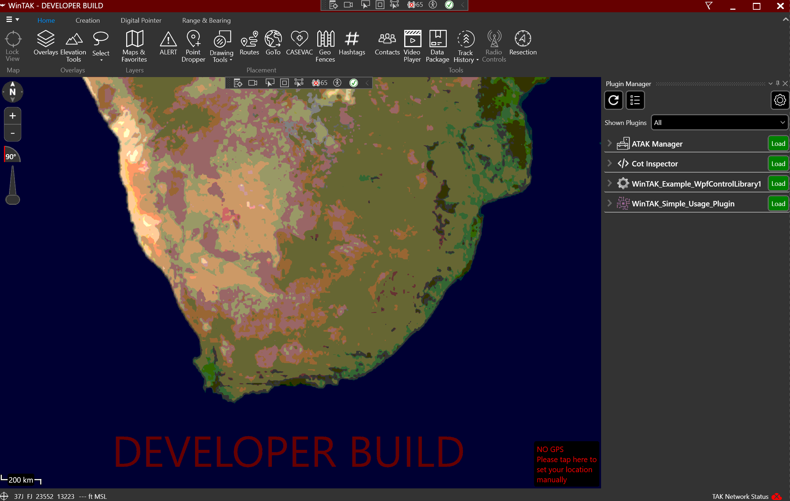
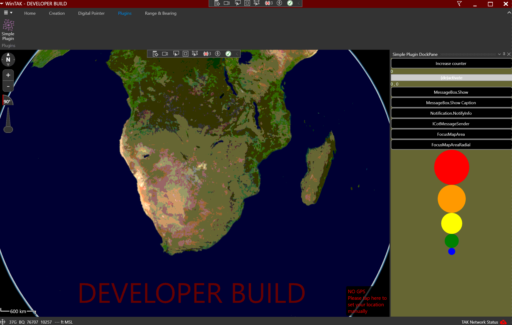
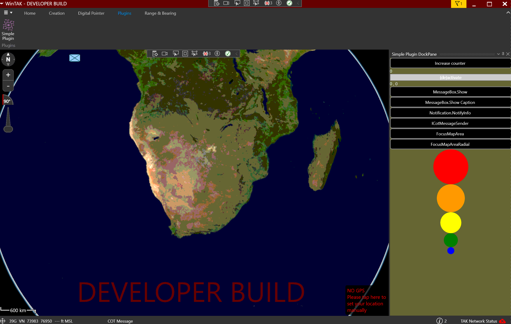
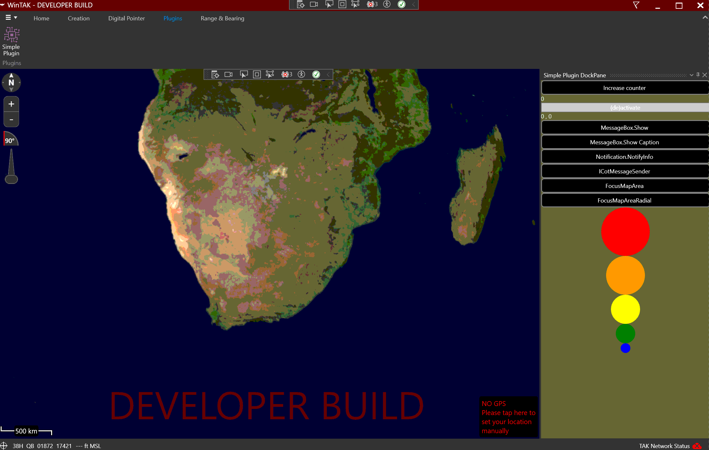
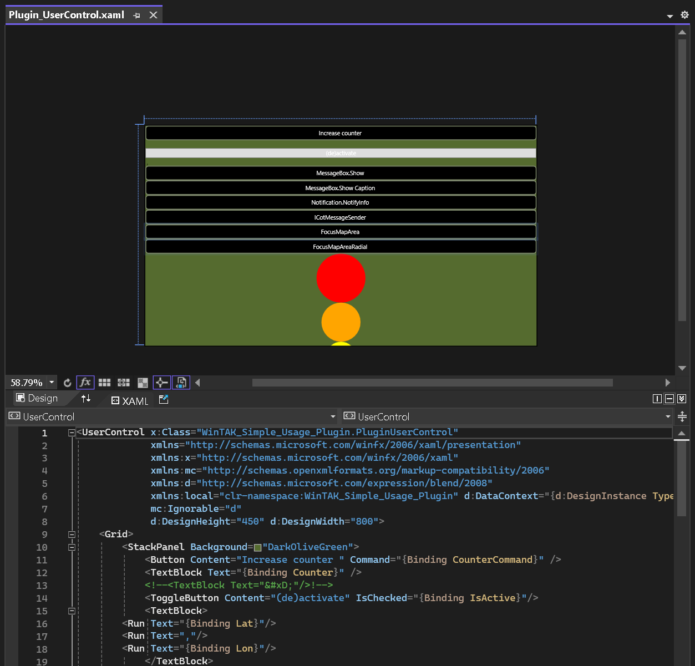
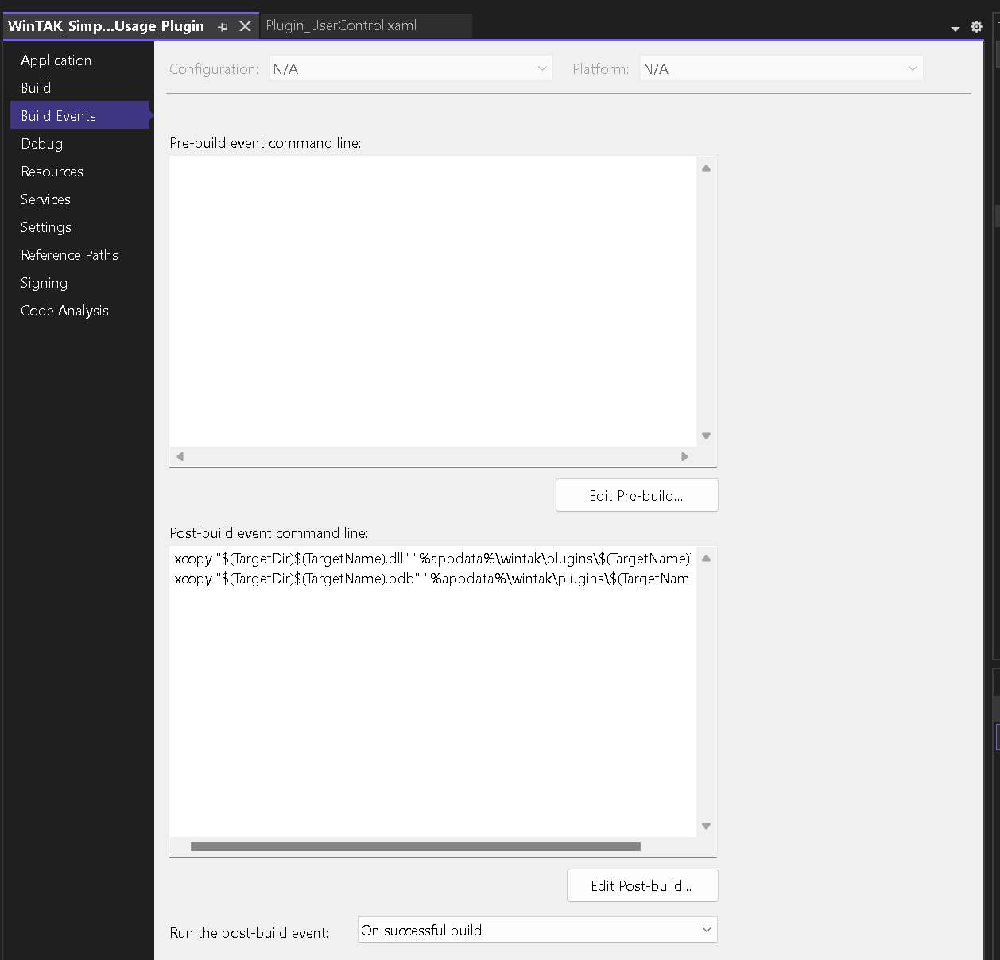
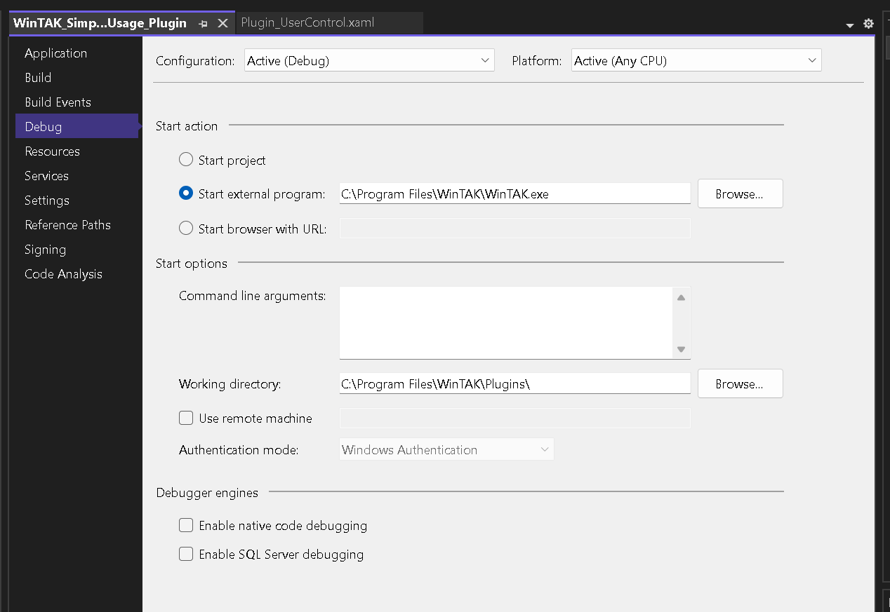

# WinTAK Simple Usage Plugin

[](img/iqblue_logo.png)

*Developed by C.A Torino, IQ-BLUE Integrated Systems*

*November 10th 2023*

* Links to IQ-BLUE Integrated Systems ZA.
    * [Website](https://iq-blue.com)
    * [TAK-ZA](https://tak-za.co.za)
    * [CSMT portal](https://csmt.iq-blue.com)
    * [BI portal](https://bi.iq-blue.com)
    * [IOT portal](https://iot.iq-blue.com)
    * [F&Q](https://support.iq-blue.com)

[](img/Plugin.gif)

A simple plugin showing a few of the basic components which can be utilized when you develop a plugin for **WinTAK**

Old doxygen documentation has been uploaded to my website [here](https://iq-blue.com/WinTAK_SDK_Documentation/Doc/html).

Youtube example video can be found [coming soon]().

Plugin specs:
- Plugin made for WinTAK `4.10.0.170`
- .Net Framework 4.8.0
- Visual Studio 2022
- Windows 11
- Nvidea 2060 super
- intel i7
- Nuget Packages
    - Prism.Mef 6.3.1
    - WinTak-Dependencies 4.10.0.170
    - Angle-Dist 2.1.17392
    - CommonServiceLocator 1.3.0
    - libLAS 1.8.2
    - Prism.Core 6.3.1
    - Prism.Wpf 6.3.1
    - TAK.Kernel 4.6.32
    - TTP-Dist 2.11.0


Examples currently added:
- ✅ **Increase counter**
- ✅ **(de)activate mouse** lat, lon
- ✅ **MessageBox.Show** (WinTAK UI)
- ✅ **MessageBox.Show** (With Caption) (WinTAK UI)
- ✅ **Notification.NotifyInfo** (WinTAK UI)
- ✅ **ICotMessageSender** (Interface) (WinTAK UI)
- ✅ **FocusMapArea** (WinTAK UI)
- ✅ **FocusMapAreaRadial** (COT with Radial) (WinTAK UI)
- ⬜️ **Https request** (WinTAK UI)

N.B the application has been created with the microsoft Visual Studio 2022 Community IDE. (https://visualstudio.microsoft.com/vs/)

https://dotnet.microsoft.com/download/visual-studio-sdks


# Example Guide

## 1. Coding Style

- Please read the Naming Guidelines found here: https://msdn.microsoft.com/en-us/library/ms229042.aspx
- Key Style Guidelines
    - DO NOT use hungarian style notation in C# (m_iSomeInteger fields, bSomeBoolean parameter <= don't want to see that)
    - DO use PascalCasing for class names, method names and public properties
    - DO use camelCasing for parameter names
    - DO use camelCasing with an underscore prefix for private fields (private _someField)
    - DO follow the Microsoft Framework Design Guidelines!

## 2. Focus on a Map Area

[](img/FocusMapArea.gif)

Client code can programmatically request **WinTAK** to focus on a GeoPoint(s) (pan and zoom to).

This and other actions can be achieved with the `WinTak.Framework.Messaging.IMessageHub` pub/sub interface.

```C#
class MyPluginClass
{
    private WinTak.Framework.Messaging.IMessageHub _messageHub;

    [ImportingConstructor]
    public MyPluginClass(WinTak.Framework.Messaging.IMessageHub messageHub)
    {
        _messageHub= messageHub;
    }

    private void PanToWhiteHouse()
    {
        var message = new WinTak.Common.Messaging.FocusMapMessage(new GeoPoint(38.8977, -77.0365)){ Behavior = MapFocusBehavior.PanOnly };
        _messageHub.Publish(message);
    }
}
```

## 3. Focus on a MapObject and Showing the Radial Menu

[](img/FocusMapAreaRadial.gif)

Client code can programmatically request **WinTAK** to focus on a MapObject (pan and zoom to),
as well as show the radial menu.

This and other actions can be achieved with the `WinTak.Framework.Messaging.IMessageHub` pub/sub interface.

```C#
class MyPluginClass
{
    private WinTak.Framework.Messaging.IMessageHub _messageHub;

    [ImportingConstructor]
    public MyPluginClass(WinTak.Framework.Messaging.IMessageHub messageHub)
    {
        _messageHub= messageHub;
    }

    private void PanToWhiteHouse()
    {
        string uid = ... // UID of existing Map Object
        var message = new WinTak.Common.Messaging.PanToMapObjectMessage(uid){ ShowRadialMenu = true };
        _messageHub.Publish(message);
    }
}
```

## 4. Runtime Plugin Loading and Part Recomposition

With **WinTAK 4.0** Plugins can now be loaded or unloaded at runtime.

In previous versions of **WinTAK** a restart was necessary in order to change which plugins were being loaded.

With this feature in mind Plugin developers need to make sure that their plugins can handle runtime loading/unloading by being able to recompose parts.

**WinTAK** plugins use **MEF** for dependency injection.

Most core services of **WinTAK** are brought into a plugin via plugin classes using an `[ImportingConstructor]`.

However, this is not the only way to acquire an exported interface from **WinTAK**.

In addition to `[ImportingConstructor]`'s you can make use of an `[Import]` property. The benefit of [Import] properties is that they can allow for recomposition, and they can be used to ingest interfaces that may not always be available.

```C#
class MyPluginClass
{
    private IEnumerable<WinTak.Location.Providers.ILocationProvider> _locationProviders;

    [ImportingConstructor]
    public MyPluginClass(IEnumerable<WinTak.Location.Providers.ILocationProvider> locationProviders)// This could cause an exception if a plugin is loaded/unloaded that exports an ILocationProvider
    {
        _locationProviders = locationProviders;
    }

    [ImportMany(AllowRecomposition = true)]
    IEnumerable<WinTak.Location.Providers.ILocationProvider> LocationProviders// Because this property allows recomposition it will not cause an exception if a plugin is loaded/unloaded
    {
        get { return _locationProviders; }
        set { _locationProviders = value; }
    }
}
```

As a general rule you should make use of [Import] properties over [ImportingConstructor]'s when Importing a collection of Interfaces.

Plugins can export their own `ILocationProvider`,
`IChatService` and
`IAlertProvider` interfaces as a few examples,
and all of these interfaces must be Imported's as an `IEnumerable` collection of interfaces.

(because there will most likely be more then 1 of each of these interfaces available) 
and therefore should be ingested via `[Import]` properties over an `[ImportingConstructor]`. 

## 5. Sending and Recieving CoT Messages

[](img/ICotMessageSender.gif)

`WinTak.CursorOnTarget.Services.ICotMessageSender` and `WinTak.CursorOnTarget.Services.ICotMessageReceiver` are the CoT message handling interfaces.
These interfaces are used to send and recieve CoT messages internally.

`ICotMessageReceiver` can be used to inspect any incoming messages that have been received from the network,
or that are being created and sent by other plugins or core WinTAK via the `ICotMessageSender` interface.

`ICotMessageSender` is used to send messages internally so that they can be handled and processed by core **WinTAK** (and other plugins)
as if the message has been received from one of it's network inputs.

These interfaces can be acquired via Dependency Injection by your class's ImportingConstructor or via an Import property.


```C#
class MyPluginClass
{
    private WinTak.CursorOnTarget.Services.ICotMessageSender _messageSender;

    [ImportingConstructor]
    public MyPluginClass(WinTak.CursorOnTarget.Services.ICotMessageSender messageSender, WinTak.CursorOnTarget.Services.ICotMessageReceiver messageReceiver)
    {
        _messageSender = messageSender;
        messageReceiver.MessageReceived += OnMessageReceived;
    }

    private void OnMessageReceived(object sender, WinTak.Common.CoT.CoTMessageArgument args)
    {
        // Handle CoT Message
    }
}
```

Sending a COT example

```C#
/// <summary>
/// Sends Cot XML stream to all connected EUDs.
/// </summary>
/// <param name="type">Type to send</param>
/// <param name="callsign">Callsign</param>
/// <param name="lon">Longitude</param>
/// <param name="lat">Latitude</param>
public static string XMLSendCot(string type, string callsign, string lon, string lat)
{
    //XMLSendCot("a-f-G","C.A Torino","0","0");
    //type = a-f-G
    //type = a-h-G-U-C-E
    string timeStart = DateTime.UtcNow.ToString("o");
    string stale = DateTime.UtcNow.AddMinutes(5).ToString("o");
    string g = Guid.NewGuid().ToString();//80992df2-e9af-11eb-a4c3-0025907b8f7d
    string x =
    "<?xml version = \"1.0\" encoding = \"UTF-8\"?>" +
    $"<event version=\"2.0\" uid=\"{g}\" type=\"{type}\" how=\"h-g-i-g-o\" start=\"{timeStart}\" time=\"{timeStart}\" stale=\"{stale}\">" +
    "<detail>" +
    $"<contact callsign=\"{callsign}\" />" +
    "</detail>" +
    $"<point le=\"9999999.0\" ce=\"9999999.0\" hae=\"9999999.0\" lon=\"{lon}\" lat=\"{lat}\" />" +
    "</event>";
    return x;
}

string coTXMLSendCot = CoTxmlClass.XMLSendCot("a-f-G-U-C-I", "C.A Torino", "0", "0");
var cotXml = new XmlDocument();
cotXml.LoadXml(coTXMLSendCot);
_messageSender.Send(cotXml);
```

To send a CoT message to the network the `WinTak.Common.Services.ICommunicationService` interface is used.

This interface has BroadcastCot and SendCot methods that can be used to either broadcast a CoT message to every node on the network,
or send it to a known Contact on the network.

## 5. UI Design

[](img/UIDesign.png)

**WinTAK** has a Styles Resource Dictionary that plugin developers are encouraged to use so that they can provide a uniform look and feel within their plugins.

 The Resource Dictionary can be included in one of your plugin's **XAML** views with the following code snippet:

```xml
<UserControl.Resources>
    <ResourceDictionary>
        <ResourceDictionary.MergedDictionaries>
            <ResourceDictionary Source="/WinTak.UI;component/DefaultTheme.xaml" x:Name="Dict"/>
        </ResourceDictionary.MergedDictionaries>
    </ResourceDictionary>
</UserControl.Resources>
```

With the **WinTAK** `DefaultTheme.xaml` included in your **XAML** you can make use of the same styles used by **WinTAK**.

 Below is a list of some of the common ones.

`DarkButtonStyle` - Default Style for buttons, black with a grey border.

`ToolBarButtonStyle` - Button style similar to DarkButtonStyle, size is intended for buttons placed at the top of a dock pane view.

`DarkIconButtonStyle` - Similar to DarkButtonStyle but intended for buttons with Image content instead of Text content.

`DarkToggleButtonStyle` - Default style for ToggleButtons, similar look to DarkButtonStyle.

`ToolBarToggleButtonStyle` - ToggleButton style similar to DarkToggleButtonStyle, size is intended for buttons placed at the top of a dock pane view.

`DarkToggleGreenBorderButtonStyle` - Toggle Button Style that's border changes to green when toggled on.

`ArrowButtonStyle` - Toggle Button style that displays a triangular arrow pointing right when disabled, arrow pointing down when enabled.

`HeaderBorderStyle` - Style for borders, intended for the top of a dockpane view where tool bar buttons can be placed.

`CheckboxStyle` - Style for Checkboxes, black with grey square and grey checkmark.

`LargeCheckboxStyle` - Larger version of CheckboxStyle.

`LockSwitchStyle` - Style for checkbox that appears as a switch button. Change the Foreground color to customize the color displayed when in the 'locked' position.

## Debugging Plugins

[](img/PostBuild.png)

Visual Studio can be used to debug **WinTAK** plugins.


When you build your Plugin Project it should have a Post-build event that copies your plugin `.dll`(s) to `%appdata%\WinTAK\Plugins\<YourPluginFolder>`.

WinTAK will search for new Plugin dll's in `%appdata%\WinTAK\Plugins` folder and subfolders and prompt users to load these plugins during startup.

```batch
xcopy "$(TargetDir)$(TargetName).dll" "%appdata%\wintak\plugins\" /y
xcopy "$(TargetDir)$(TargetName).pdb" "%appdata%\wintak\plugins\" /y
```

From within your Project Properties,
Click on the Debug tab and set the Start action to Start external program and also set the Working Directory to point to the location where `WinTak.exe` is located.

For 64-bit installation of WinTak:

[](img/Debug.png)

Path to executable:

```
C:\Program Files\WinTak\WinTak.exe
```


Path to Working Directory:

```
C:\Program Files\WinTak
```


Click the Start button or press F5 to launch WinTAK and start debugging your plugin.

If you are launching your plugin for the first time you should see a prompt in WinTAK asking if you want to load your plugin.

Check this checkbox and select OK.

Any breakpoints you have set in your plugins code should be hit.

## System Requirements

The latest version of **WinTAK** will run on **Win 10 64-bit** systems.

Performance of the application is highly dependent on the machine specifications i.e. it will run on a system with *4 GB of ram* but is slow.

Performance is much better with **8 GB - 12 or 16 GB** is even better.

- Operating System
    - **Windows 10** is recommended. 
- Graphics
    - WinTAK requires a graphics processor that supports **D3D9** or **D3D11**.
- Storage, Memory and Processor
    - A **64-bit processor** is recommended.  
    WinTAK does not have any specific requirements for storage, 
    memory or processor speed, however, performance of the application will depend on the configuration.

# TODO

- Reduce code.
- Improve methods
- Add more features.

> TAK https://tak.gov

> Checkout my tutorials https://tutorials.techrad.co.za/2021/04/13/freetakserver-manager

> Video demonstration ToDo

> Source code https://github.com/Cale-Torino/WinTAK_Simple_Usage_Plugin

# Links

* [WinForms FreeTAKServer_Manager application](https://github.com/Cale-Torino/FreeTAKServer_Manager/tree/main/WinForms "WinForms application")
* [WPF FreeTAKServer_Manager application](https://github.com/Cale-Torino/FreeTAKServer_Manager/tree/main/WPF "WPF application")